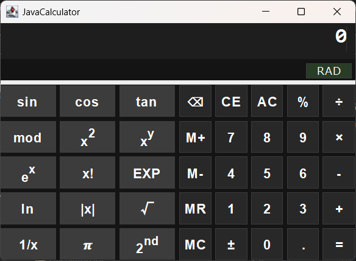
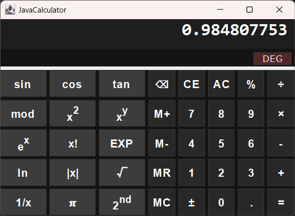
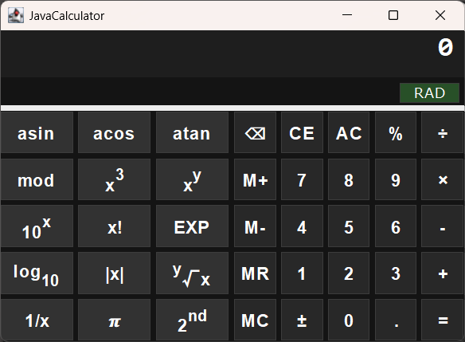

# 簡単関数電卓

このアプリは Java Swing の学習を目的として開発した高精度の科学電卓アプリです。  
BigDecimal による正確な計算処理と、状態遷移を用いた安定した入力制御を特徴としています。  
GUI は Swing をベースに、直感的で使いやすいレイアウトを実現しています。

---

## 📸 Screenshots

### メイン画面

### 関数ボタンの例

### パネル切り替えボタンの例

---

## 📚 学習目的

- Java の基礎〜応用の習得
- GUI アプリ開発
- 高精度計算の実装
- 数学関数の実装（Lanczos / Stirling）
- GitHub を使ったプロジェクト管理

---

## ✨ 主な機能

### 🔢 基本機能
- 四則演算（+ / - / × / ÷）
- 小数点入力
- 符号反転（±）
- クリア（C / AC）

### 🧮 高度な数学関数
- x²（2乗）
- x³（3乗）
- xʸ（べき乗）
- y√x（y乗根）
- sin / cos / tan
- log / ln
- EXP 入力
- 小数対応 mod（BigDecimal.remainder）

### 🔧 入力制御（状態遷移）
独自の状態管理により、安定した入力処理を実現しています。

- INPUT_NUM1  
- INPUT_NUM2  
- AFTER_OPERATOR  
- AFTER_UNARY  
- AFTER_EQUAL  
- OVERWRITE  

これにより、  
「関数の連続適用」「= の連打」「演算子の連続入力」などの複雑な操作にも対応しています。

---

## 🛠 技術スタック

- **Java 8（互換ビルド）**
- **Swing（GUI）**
- **BigDecimal（高精度計算）**
- **Eclipse（開発環境）**

---

## 🚀 実行方法

### ✔ Windows（Java 不要）
以下の exe を実行するだけで動作します：

dist/Calculator_free.exe

※ JRE 同梱版を使用しているため、Java のインストールは不要です。

---

### ✔ Windows / Mac / Linux（Java 必要）
Java がインストールされている環境では jar からでも実行できます：

java -jar dist/Calculator.jar

---

## 📁 フォルダ構成

'''
JavaCalculator/
├─ src/                     ソースコード
├─ images/　　　　　　　　 スクリーンショット
├─ dist/                    配布物（jar / exe / jre 同梱版）
│    ├─ Calculator.jar
│    ├─ Calculator_free.exe
│    └─ jre/               （Java 不要で動くための同梱 JRE）
├─ .gitignore
└─ README.md

---

## 💡 工夫したポイント

- BigDecimal による誤差のない高精度計算
- 独自の状態遷移による安定した入力処理
- 関数の連続適用や = の連打にも対応
- Swing の HTML ラベルを活用した上付き文字（x², xʸ）の表現
- Java 8 互換ビルドにより幅広い環境で動作
- JRE 同梱版 exe により Java 未インストール環境でも実行可能

---

## 📦 配布について

- `dist/Calculator.jar` → Java がある環境向け  
- `dist/Calculator.exe` → Windows 向け（Java 不要）  
- `dist/jre/` → exe 用の同梱 JRE（GitHub では .gitignore で除外）

必要に応じて GitHub Releases に JRE 同梱版を zip で公開できます。

---

## 🔧 更新履歴
###  2026-05-13
・機能の切り替え方法を見直し、長押し形式からシフトボタン形式へ変更
・階乗計算（ガンマ関数使用の小数点にも対応した形式）、絶対値の実装
・電卓ボタンの表記改善
・その他構成の見直し

---

## 👤 作者
Lilica  
Java / GUI アプリ開発  

